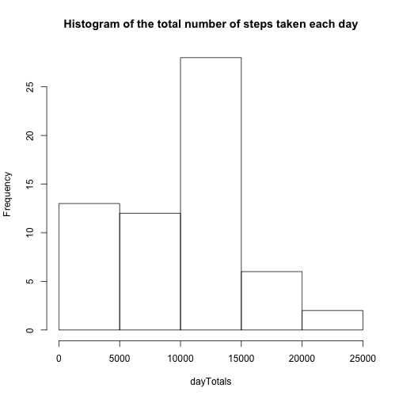
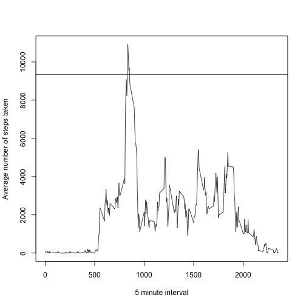
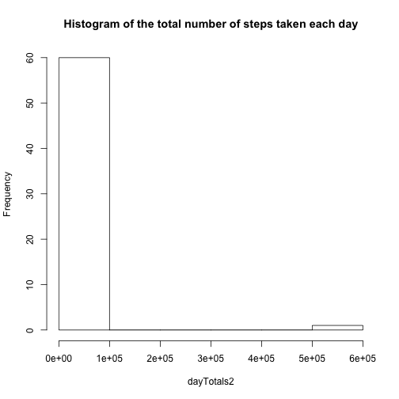
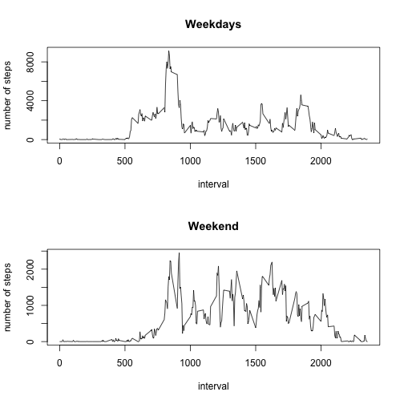

Reproducible Research Assignment 1
======================================================


```r
# Reading Data in
library(data.table)
library(knitr)

setwd("/Users/Robert/Desktop/DataScienceTrack/ReproducibleResearch")
url <- "http://d396qusza40orc.cloudfront.net/repdata%2Fdata%2Factivity.zip"

download.file(url, paste(getwd(), "/assign1.zip", sep = ""), "curl")
unzip("assign1.zip")
data <- data.table(fread("activity.csv"))
```

```
## 
0%
      
```


```r
dayTotals <- tapply(data$steps, data$date, sum, na.rm = TRUE)
```

histogram of the total number of steps taken each day

```r
hist(dayTotals, main = "Histogram of the total number of steps taken each day")
```

 

mean and median number of steps taken each day 

```r
mean(dayTotals, na.rm = TRUE)
```

```
## [1] 9354
```

```r
median(dayTotals, na.rm = TRUE)
```

```
## [1] 10395
```


```r
minuteTotals <- tapply(data$steps, data$interval, sum, na.rm = TRUE)
plot(unique(data$interval), minuteTotals, type = "l", ylab = "Average number of steps taken", 
    xlab = "5 minute interval")
abline(h = mean(dayTotals, na.rm = TRUE))
```

 


5-minute interval that, on average, contains the maximum number of steps

```r
data$interval[which(minuteTotals == max(minuteTotals))]
```

```
## [1] 835
```


Strategy for imputing missing data

```r
nrow(data) - length(which(complete.cases(data)))
```

```
## [1] 2304
```

```r

naI <- which(complete.cases(data) == FALSE)
data2 <- data
data2$steps[naI] <- minuteTotals[which(unique(data$interval) == data2$interval[naI])]
dayTotals2 <- tapply(data2$steps, data2$date, sum, na.rm = TRUE)
```


Histogram of the total number of steps taken each day after missing values were imputed

```r
hist(dayTotals2, main = "Histogram of the total number of steps taken each day")
```

 


```r
day <- weekdays(as.Date(data$date))

weekendI <- which(day == "Sunday" | day == "Saturday")
day[1:17568] <- "weekday"
day[weekendI] <- "weekend"
day <- as.factor(day)
data3 <- cbind(data, day)
```

Panel plot comparing the average number of steps taken per 5- minute interval across weekdays and weekends

```r
minuteTotals2 <- tapply(data3$steps, list(data3$interval, data3$day), sum, na.rm = TRUE)
par(mfrow = c(2, 1))
plot(unique(data3$interval), minuteTotals2[, 1], ylab = "number of steps", xlab = "interval", 
    main = "Weekdays", type = "l")
plot(unique(data3$interval), minuteTotals2[, 2], ylab = "number of steps", xlab = "interval", 
    main = "Weekend", type = "l")
```

 

